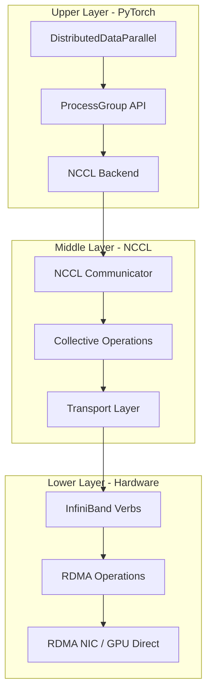

# How NCCL Works with Upper Layers (PyTorch) and Lower Layers (Verbs)

## Abstract

The NVIDIA Collective Communication Library (NCCL) serves as the critical middleware layer enabling high-performance distributed deep learning. This white paper provides a comprehensive overview of how NCCL integrates with upper-layer frameworks like PyTorch and lower-layer network interfaces like InfiniBand Verbs. We examine the complete communication stack from PyTorch's `torch.distributed` API down to RDMA hardware operations, explaining how data flows through each layer and how the abstractions are connected. This document is intended for engineers and researchers new to distributed GPU computing who want to understand the end-to-end architecture of modern distributed training systems.

**Keywords:** NCCL, PyTorch, Distributed Training, RDMA, InfiniBand Verbs, Collective Communication, GPU Computing

---

## 1. Introduction

### 1.1 The Distributed Training Challenge

Modern deep learning models require computational resources that exceed the capacity of a single GPU. Training large language models, computer vision networks, and other AI systems necessitates distributing computation across multiple GPUs, often spanning multiple physical servers. This introduces a fundamental challenge: how do we efficiently synchronize data between GPUs?

The answer lies in a carefully designed software stack that bridges high-level training frameworks with low-level hardware communication primitives. At the center of this stack sits NCCL, which translates abstract collective operations into optimized hardware-specific implementations.

### 1.2 The Communication Stack Overview

The distributed GPU communication stack can be visualized as follows:



**Layered Architecture (Text Representation):**

```
┌─────────────────────────────────────────────────────────────────┐
│                    APPLICATION LAYER                             │
│         (Training Scripts, Model Code, Loss Functions)          │
├─────────────────────────────────────────────────────────────────┤
│                    FRAMEWORK LAYER                               │
│     (PyTorch torch.distributed, TensorFlow, JAX, etc.)          │
├─────────────────────────────────────────────────────────────────┤
│                COMMUNICATION LIBRARY LAYER                       │
│                      (NCCL / RCCL / Gloo)                       │
├─────────────────────────────────────────────────────────────────┤
│                    TRANSPORT LAYER                               │
│           (InfiniBand Verbs, TCP/IP Sockets, NVLink)            │
├─────────────────────────────────────────────────────────────────┤
│                    HARDWARE LAYER                                │
│         (GPUs, NICs, NVLink/NVSwitch, PCIe, Network)            │
└─────────────────────────────────────────────────────────────────┘
```

This paper focuses on the interactions between these layers, with particular attention to:
- **Upper Layer**: How PyTorch interfaces with NCCL
- **Core Layer**: What NCCL provides and how it works
- **Lower Layer**: How NCCL interfaces with InfiniBand Verbs

---

## 2. PyTorch Distributed: The Upper Layer

### 2.1 PyTorch's Distributed Communication Architecture

PyTorch provides the `torch.distributed` package for distributed training. This package abstracts away the complexities of inter-GPU communication, allowing researchers to focus on model architecture and training logic.

The key components of PyTorch's distributed layer are:

```
┌─────────────────────────────────────────────────────────────────┐
│                  torch.distributed Package                       │
├─────────────────────────────────────────────────────────────────┤
│                                                                  │
│  ┌─────────────────┐  ┌──────────────────┐  ┌────────────────┐ │
│  │  Process Groups │  │ Distributed Data │  │   Collective   │ │
│  │   Management    │  │   Parallel (DDP) │  │   Operations   │ │
│  └────────┬────────┘  └────────┬─────────┘  └───────┬────────┘ │
│           │                    │                     │          │
│           └────────────────────┼─────────────────────┘          │
│                                │                                 │
│                    ┌───────────▼───────────┐                    │
│                    │    Backend Interface  │                    │
│                    │   (ProcessGroupNCCL)  │                    │
│                    └───────────────────────┘                    │
│                                                                  │
└─────────────────────────────────────────────────────────────────┘
```

### 2.2 Process Groups and Backends

PyTorch uses the concept of **process groups** to manage communication. A process group defines which processes (typically one per GPU) can communicate with each other.

**Initializing a Process Group:**

```python
import torch.distributed as dist

# Initialize the default process group with NCCL backend
dist.init_process_group(
    backend='nccl',           # Use NCCL for GPU communication
    init_method='env://',     # Get rank/world from environment variables
    world_size=8,             # Total number of GPUs
    rank=0                    # This process's rank (0-7)
)
```

**Supported Backends:**

| Backend | Target Hardware | Primary Use Case |
|---------|-----------------|------------------|
| NCCL | NVIDIA GPUs | GPU-to-GPU collective operations |
| Gloo | CPU/GPU | CPU tensors, fallback for GPU |
| MPI | CPU | Traditional HPC workloads |

### 2.3 ProcessGroupNCCL: The NCCL Binding

When you specify `backend='nccl'`, PyTorch creates a `ProcessGroupNCCL` object that wraps NCCL functionality. This class is defined in PyTorch's C++ backend and provides:

1. **NCCL Communicator Management**: Creates and manages NCCL communicators
2. **Tensor Conversion**: Handles PyTorch tensor to NCCL-compatible buffers
3. **Asynchronous Operations**: Manages CUDA streams for async communication
4. **Error Handling**: Translates NCCL errors to Python exceptions

**Key C++ Implementation (Simplified):**

```cpp
// PyTorch ProcessGroupNCCL (simplified from torch/csrc/distributed/c10d/)
class ProcessGroupNCCL : public ProcessGroup {
public:
    // Initialize NCCL communicator
    void initNCCLComm(int rank, int size) {
        ncclUniqueId ncclId;
        if (rank == 0) {
            ncclGetUniqueId(&ncclId);
        }
        // Broadcast ncclId to all ranks via bootstrap
        ncclCommInitRank(&ncclComm_, size, ncclId, rank);
    }
    
    // Implement allreduce collective
    c10::intrusive_ptr<Work> allreduce(
        std::vector<at::Tensor>& tensors,
        const AllreduceOptions& opts) override {
        
        // Get CUDA stream for this operation
        cudaStream_t stream = getCurrentCUDAStream();
        
        // Call NCCL allreduce
        ncclAllReduce(
            tensors[0].data_ptr(),      // send buffer
            tensors[0].data_ptr(),      // recv buffer (in-place)
            tensors[0].numel(),         // element count
            getNcclDataType(tensors[0].scalar_type()),
            ncclSum,                    // reduction operation
            ncclComm_,                  // NCCL communicator
            stream                      // CUDA stream
        );
        
        return createWork(stream);
    }
    
private:
    ncclComm_t ncclComm_;
};
```

### 2.4 Collective Operations in PyTorch

PyTorch's `torch.distributed` provides high-level collective operations that map directly to NCCL primitives:

| PyTorch Function | NCCL Function | Description |
|------------------|---------------|-------------|
| `dist.all_reduce()` | `ncclAllReduce()` | Reduce tensor across all ranks, distribute result |
| `dist.broadcast()` | `ncclBroadcast()` | Send tensor from one rank to all others |
| `dist.all_gather()` | `ncclAllGather()` | Gather tensors from all ranks to all ranks |
| `dist.reduce_scatter()` | `ncclReduceScatter()` | Reduce and distribute different chunks |
| `dist.reduce()` | `ncclReduce()` | Reduce tensor to single rank |
| `dist.send()` / `dist.recv()` | `ncclSend()` / `ncclRecv()` | Point-to-point communication |

**Example Usage:**

```python
import torch
import torch.distributed as dist

# Assume process group is initialized
tensor = torch.randn(1000, device='cuda')

# AllReduce: Sum tensors across all GPUs
dist.all_reduce(tensor, op=dist.ReduceOp.SUM)

# Broadcast: Send tensor from rank 0 to all others
dist.broadcast(tensor, src=0)

# AllGather: Collect tensors from all ranks
gathered = [torch.zeros_like(tensor) for _ in range(dist.get_world_size())]
dist.all_gather(gathered, tensor)
```

### 2.5 DistributedDataParallel (DDP)

The most common use of PyTorch distributed is through `DistributedDataParallel` (DDP), which automatically synchronizes gradients during training:

```python
import torch.nn as nn
from torch.nn.parallel import DistributedDataParallel as DDP

# Wrap model with DDP
model = MyModel().cuda()
model = DDP(model)

# Training loop - DDP handles gradient sync automatically
for batch in dataloader:
    loss = model(batch)
    loss.backward()  # Gradients are synchronized here via NCCL AllReduce
    optimizer.step()
```

**DDP Internal Flow:**

```
Forward Pass                     Backward Pass
     │                                │
     ▼                                ▼
┌─────────┐                    ┌─────────────┐
│ Compute │                    │   Compute   │
│ Output  │                    │  Gradients  │
└─────────┘                    └──────┬──────┘
                                      │
                                      ▼
                               ┌─────────────┐
                               │   Bucket    │
                               │ Gradients   │
                               └──────┬──────┘
                                      │
                                      ▼
                               ┌─────────────┐
                               │   NCCL      │
                               │ AllReduce   │
                               └──────┬──────┘
                                      │
                                      ▼
                               ┌─────────────┐
                               │  Average    │
                               │  Gradients  │
                               └─────────────┘
```

DDP uses gradient bucketing to reduce the number of NCCL calls and overlaps communication with computation for better performance.

---

## 3. NCCL: The Core Communication Layer

### 3.1 What is NCCL?

NCCL (NVIDIA Collective Communications Library) is a library of optimized collective communication primitives for multiple GPUs. It provides:

1. **High-Performance Collectives**: Optimized implementations of AllReduce, Broadcast, AllGather, etc.
2. **Multi-Transport Support**: Works over NVLink, PCIe, and network (InfiniBand, Ethernet)
3. **Topology Awareness**: Automatically detects and optimizes for hardware topology
4. **Multiple Algorithms**: Ring, tree, and other algorithms selected based on message size and topology

### 3.2 NCCL Architecture Overview

```
┌─────────────────────────────────────────────────────────────────┐
│                      NCCL Library                                │
├─────────────────────────────────────────────────────────────────┤
│                                                                  │
│  ┌──────────────────────────────────────────────────────────┐  │
│  │                 Collective Operations                      │  │
│  │  (AllReduce, Broadcast, AllGather, ReduceScatter, etc.)  │  │
│  └───────────────────────────┬──────────────────────────────┘  │
│                              │                                   │
│  ┌───────────────────────────▼──────────────────────────────┐  │
│  │                   Algorithm Selection                      │  │
│  │            (Ring, Tree, CollNet, NVLS)                    │  │
│  └───────────────────────────┬──────────────────────────────┘  │
│                              │                                   │
│  ┌───────────────────────────▼──────────────────────────────┐  │
│  │                    Channel Layer                           │  │
│  │           (Parallel communication paths)                   │  │
│  └───────────────────────────┬──────────────────────────────┘  │
│                              │                                   │
│  ┌───────────────────────────▼──────────────────────────────┐  │
│  │                   Transport Layer                          │  │
│  │                                                            │  │
│  │  ┌─────────┐  ┌─────────┐  ┌─────────┐  ┌─────────────┐  │  │
│  │  │   P2P   │  │   SHM   │  │ NET/IB  │  │ NET/Socket  │  │  │
│  │  │(NVLink) │  │(Shared  │  │(RDMA)   │  │  (TCP/IP)   │  │  │
│  │  │         │  │ Memory) │  │         │  │             │  │  │
│  │  └─────────┘  └─────────┘  └─────────┘  └─────────────┘  │  │
│  │                                                            │  │
│  └──────────────────────────────────────────────────────────┘  │
│                                                                  │
└─────────────────────────────────────────────────────────────────┘
```

### 3.3 NCCL Communicator and Initialization

NCCL communication begins with creating a communicator that establishes connections between all participating GPUs:

```c
// Create unique ID on rank 0
ncclUniqueId id;
if (rank == 0) {
    ncclGetUniqueId(&id);
}

// Broadcast ID to all ranks (via MPI, sockets, etc.)
MPI_Bcast(&id, sizeof(id), MPI_BYTE, 0, MPI_COMM_WORLD);

// Each rank initializes its communicator
ncclComm_t comm;
ncclCommInitRank(&comm, world_size, id, rank);
```

During initialization, NCCL:
1. Discovers the hardware topology (GPUs, NVLinks, NICs)
2. Establishes connections between peers
3. Allocates communication buffers
4. Selects optimal algorithms and protocols

### 3.4 Collective Algorithm Selection

NCCL implements multiple algorithms optimized for different scenarios:

**Ring Algorithm:**
```
Optimal for: Large messages, high bandwidth utilization

GPU0 ──► GPU1 ──► GPU2 ──► GPU3
  ▲                          │
  └──────────────────────────┘

Data flows around the ring in multiple steps
Total steps: 2(N-1) for AllReduce with N GPUs
```

**Tree Algorithm:**
```
Optimal for: Small messages, low latency

           GPU0
          ╱    ╲
       GPU1    GPU2
      ╱    ╲
   GPU3    GPU4

Data flows up and down the tree
Latency: O(log N)
```

**NVLS (NVLink SHARP):**
```
Optimal for: Systems with NVSwitch

        ┌──────────────┐
        │   NVSwitch   │
        │   Reduces    │
        │   In-Fabric  │
        └──────────────┘
             │
    ┌────────┼────────┐
    ▼        ▼        ▼
  GPU0     GPU1     GPU2

Single-step reduction in the switch
```

### 3.5 NCCL Channels and Protocols

**Channels** are independent parallel communication paths that NCCL uses to maximize bandwidth:

```
Channel 0: GPU0 ══► GPU1 ══► GPU2 ══► GPU3 ══► GPU0
Channel 1: GPU0 ══► GPU3 ══► GPU2 ══► GPU1 ══► GPU0
Channel 2: (and more channels as needed)

Each channel can use different NVLinks/NIC ports
```

**Protocols** optimize for different message sizes:

| Protocol | Message Size | Characteristics |
|----------|--------------|-----------------|
| LL (Low Latency) | < 256 KB | 8-byte inline messages, CPU involvement |
| LL128 | 256 KB - 1 MB | 128-byte messages, less CPU overhead |
| Simple | > 1 MB | Maximum bandwidth, GPU-driven |

---

## 4. InfiniBand Verbs: The Lower Layer

### 4.1 Introduction to RDMA and Verbs

**RDMA** (Remote Direct Memory Access) allows direct memory-to-memory data transfer between servers without CPU involvement. The **Verbs API** (libibverbs) is the standard programming interface for RDMA operations.

Key RDMA concepts:

| Concept | Description |
|---------|-------------|
| **Protection Domain (PD)** | Isolation container for RDMA resources |
| **Memory Region (MR)** | Registered memory accessible by RDMA |
| **Queue Pair (QP)** | Send/Receive queue pair for communication |
| **Completion Queue (CQ)** | Queue for operation completion notifications |

### 4.2 RDMA Operations

```
┌────────────────────────────────────────────────────────────────┐
│                    RDMA Operation Types                         │
├────────────────────────────────────────────────────────────────┤
│                                                                 │
│  ┌─────────────────┐              ┌─────────────────┐         │
│  │   Send/Recv     │              │  RDMA Write     │         │
│  │  (Two-sided)    │              │  (One-sided)    │         │
│  └────────┬────────┘              └────────┬────────┘         │
│           │                                │                   │
│   Sender posts Send                Remote writes to           │
│   Receiver posts Recv              local memory directly      │
│                                                                 │
│  ┌─────────────────┐              ┌─────────────────┐         │
│  │   RDMA Read     │              │    Atomic Ops   │         │
│  │  (One-sided)    │              │  (One-sided)    │         │
│  └────────┬────────┘              └────────┬────────┘         │
│           │                                │                   │
│   Local reads from                Fetch-and-add,              │
│   remote memory directly          Compare-and-swap            │
│                                                                 │
└────────────────────────────────────────────────────────────────┘
```

### 4.3 How NCCL Uses Verbs

NCCL's network transport layer (`net_ib.cc`) interfaces with the Verbs API to perform inter-node communication. Here's how the key operations map:

**Connection Setup:**

```c
// NCCL's simplified connection flow
ncclResult_t ncclIbConnect(ncclNetHandle_t handle, void** sendComm) {
    // 1. Create Protection Domain
    struct ibv_pd* pd = ibv_alloc_pd(context);
    
    // 2. Create Completion Queue
    struct ibv_cq* cq = ibv_create_cq(context, depth, NULL, NULL, 0);
    
    // 3. Create Queue Pair
    struct ibv_qp_init_attr qp_init = {
        .send_cq = cq,
        .recv_cq = cq,
        .cap = { .max_send_wr = 64, .max_recv_wr = 64 },
        .qp_type = IBV_QPT_RC  // Reliable Connection
    };
    struct ibv_qp* qp = ibv_create_qp(pd, &qp_init);
    
    // 4. Exchange QP info with peer and transition to RTS state
    // (involves INIT → RTR → RTS state machine)
}
```

**Memory Registration:**

```c
// Register memory for RDMA access
ncclResult_t ncclIbRegMr(void* data, size_t size, void** mhandle) {
    // Standard host memory registration
    struct ibv_mr* mr = ibv_reg_mr(
        pd,
        data,
        size,
        IBV_ACCESS_LOCAL_WRITE | 
        IBV_ACCESS_REMOTE_WRITE |
        IBV_ACCESS_REMOTE_READ
    );
    
    // For GPU memory (GPU Direct RDMA)
    // Use ibv_reg_dmabuf_mr() for direct GPU buffer access
}
```

**Data Transfer:**

```c
// NCCL sending data via RDMA Write
ncclResult_t ncclIbIsend(void* sendComm, void* data, size_t size, 
                         void* mhandle, void** request) {
    struct ibv_send_wr wr = {
        .opcode = IBV_WR_RDMA_WRITE_WITH_IMM,  // One-sided write
        .send_flags = IBV_SEND_SIGNALED,
        .sg_list = &sge,
        .num_sge = 1,
        .wr.rdma = {
            .remote_addr = peer_addr,
            .rkey = peer_rkey
        }
    };
    
    return ibv_post_send(qp, &wr, &bad_wr);
}
```

### 4.4 GPU Direct RDMA (GDR)

GPU Direct RDMA enables the NIC to directly access GPU memory, eliminating CPU memory staging:

```
WITHOUT GPU Direct RDMA:
┌──────┐    ┌──────┐    ┌──────┐    Network    ┌──────┐    ┌──────┐    ┌──────┐
│ GPU  │───►│ CPU  │───►│ NIC  │═══════════════│ NIC  │───►│ CPU  │───►│ GPU  │
│      │PCIe│Memory│PCIe│      │               │      │PCIe│Memory│PCIe│      │
└──────┘    └──────┘    └──────┘               └──────┘    └──────┘    └──────┘
            (staging)                                       (staging)

WITH GPU Direct RDMA:
┌──────┐    ┌──────┐    Network    ┌──────┐    ┌──────┐
│ GPU  │───►│ NIC  │═══════════════│ NIC  │───►│ GPU  │
│      │PCIe│      │               │      │PCIe│      │
└──────┘    └──────┘               └──────┘    └──────┘
     Direct PCIe access                  Direct PCIe access
```

NCCL enables GDR through:

```c
// GPU memory registration for RDMA
struct ibv_mr* mr = ibv_reg_dmabuf_mr(
    pd,
    0,                    // offset
    size,                 // length
    (uint64_t)gpu_addr,   // iova (GPU virtual address)
    dmabuf_fd,            // DMA-BUF file descriptor
    IBV_ACCESS_LOCAL_WRITE | IBV_ACCESS_REMOTE_WRITE
);
```

### 4.5 Complete Verbs Data Flow

```
NCCL AllReduce over InfiniBand:

Rank 0 (GPU 0)                              Rank 1 (GPU 1)
┌─────────────┐                             ┌─────────────┐
│  GPU Memory │                             │  GPU Memory │
│  (gradients)│                             │  (gradients)│
└──────┬──────┘                             └──────┬──────┘
       │ 1. DMA to registered buffer               │
       ▼                                           ▼
┌─────────────┐                             ┌─────────────┐
│  MR (send)  │                             │  MR (send)  │
└──────┬──────┘                             └──────┬──────┘
       │ 2. Post RDMA Write                        │
       ▼                                           ▼
┌─────────────┐                             ┌─────────────┐
│    QP       │────── RDMA Write ─────────►│    QP       │
│             │◄───── RDMA Write ──────────│             │
└──────┬──────┘                             └──────┬──────┘
       │ 3. Wait on CQ                             │
       ▼                                           ▼
┌─────────────┐                             ┌─────────────┐
│  MR (recv)  │                             │  MR (recv)  │
└──────┬──────┘                             └──────┬──────┘
       │ 4. Reduce on GPU                          │
       ▼                                           ▼
┌─────────────┐                             ┌─────────────┐
│   Reduced   │                             │   Reduced   │
│   Result    │                             │   Result    │
└─────────────┘                             └─────────────┘
```

---

## 5. End-to-End Data Flow Example

### 5.1 Complete Stack Walkthrough

Let's trace a single `dist.all_reduce()` call from PyTorch down to the hardware:

```
STEP 1: PyTorch Application
─────────────────────────────
tensor = torch.randn(1000000, device='cuda')
dist.all_reduce(tensor, op=dist.ReduceOp.SUM)

STEP 2: PyTorch ProcessGroupNCCL
─────────────────────────────
ProcessGroupNCCL::allreduce() is called
- Validates tensor is on CUDA device
- Gets NCCL data type from PyTorch dtype
- Acquires CUDA stream for async execution

STEP 3: NCCL API
─────────────────────────────
ncclAllReduce(
    sendbuff,
    recvbuff, 
    count,
    ncclFloat32,
    ncclSum,
    comm,
    stream
)

STEP 4: NCCL Algorithm Selection
─────────────────────────────
Based on:
- Message size: 4MB (1M × 4 bytes)
- Topology: 2 nodes, 8 GPUs total
- Available bandwidth: NVLink + InfiniBand

Selected: Ring algorithm, Simple protocol, 4 channels

STEP 5: NCCL Channel Execution
─────────────────────────────
For each channel:
- Divide data into chunks
- Execute ring steps
- Mix intra-node (NVLink/P2P) and inter-node (RDMA) transfers

STEP 6: NCCL NET/IB Transport (Inter-node)
─────────────────────────────
For network transfers:
- ncclIbIsend() posts RDMA Write
- ncclIbIrecv() posts receive buffer
- ncclIbTest() polls CQ for completion

STEP 7: libibverbs
─────────────────────────────
ibv_post_send():
- Creates Work Request (WR)
- Writes WR to QP send queue
- Rings doorbell to notify HCA

STEP 8: Hardware (NIC/HCA)
─────────────────────────────
- DMA engine reads data from registered memory
- Network interface transmits packets
- Remote NIC writes data to destination memory
- Completion written to CQ
```

### 5.2 Sequence Diagram

```
┌──────────┐    ┌───────────┐    ┌──────┐    ┌───────────┐    ┌──────┐    ┌──────┐
│ PyTorch  │    │ PGNCCL    │    │ NCCL │    │ NET/IB    │    │Verbs │    │ HCA  │
│ App      │    │           │    │      │    │           │    │      │    │      │
└────┬─────┘    └─────┬─────┘    └──┬───┘    └─────┬─────┘    └──┬───┘    └──┬───┘
     │                │             │              │             │          │
     │ all_reduce()   │             │              │             │          │
     │───────────────►│             │              │             │          │
     │                │ ncclAllRed  │              │             │          │
     │                │────────────►│              │             │          │
     │                │             │ select algo  │             │          │
     │                │             │──────────────│             │          │
     │                │             │              │             │          │
     │                │             │ chunk loop   │             │          │
     │                │             │──────┐       │             │          │
     │                │             │      │       │             │          │
     │                │             │◄─────┘       │             │          │
     │                │             │ ncclIbIsend  │             │          │
     │                │             │─────────────►│             │          │
     │                │             │              │ ibv_post_   │          │
     │                │             │              │ send()      │          │
     │                │             │              │────────────►│          │
     │                │             │              │             │ doorbell │
     │                │             │              │             │─────────►│
     │                │             │              │             │          │
     │                │             │              │             │ DMA+TX   │
     │                │             │              │             │          │
     │                │             │              │             │◄─────────│
     │                │             │              │             │ CQE      │
     │                │             │              │◄────────────│          │
     │                │             │◄─────────────│ complete    │          │
     │                │◄────────────│              │             │          │
     │◄───────────────│             │              │             │          │
     │                │             │              │             │          │
```

---

## 6. Configuration and Tuning

### 6.1 Key Environment Variables

| Variable | Layer | Description |
|----------|-------|-------------|
| `NCCL_DEBUG` | NCCL | Debug output level (WARN, INFO, TRACE) |
| `NCCL_IB_DISABLE` | NCCL | Disable InfiniBand transport |
| `NCCL_NET_GDR_LEVEL` | NCCL/Verbs | GPU Direct RDMA enablement |
| `NCCL_ALGO` | NCCL | Force algorithm (RING, TREE) |
| `NCCL_MIN_NCHANNELS` | NCCL | Minimum parallel channels |
| `NCCL_IB_HCA` | Verbs | Select specific InfiniBand HCA |
| `NCCL_IB_TIMEOUT` | Verbs | InfiniBand timeout value |

### 6.2 Performance Optimization Guidelines

**For Maximum Bandwidth:**
```bash
export NCCL_MIN_NCHANNELS=4
export NCCL_MAX_NCHANNELS=8
export NCCL_NET_GDR_LEVEL=5
export NCCL_NET_GDR_READ=1
```

**For Minimum Latency:**
```bash
export NCCL_ALGO=TREE
export NCCL_MIN_NCHANNELS=2
```

**For Debugging:**
```bash
export NCCL_DEBUG=INFO
export NCCL_DEBUG_SUBSYS=INIT,NET,GRAPH
```

---

## 7. Summary

This white paper has examined the complete communication stack for distributed GPU training:

### 7.1 Key Takeaways

1. **PyTorch's Role**: Provides high-level abstractions (`torch.distributed`, DDP) that hide communication complexity from users while internally managing NCCL communicators and coordinating collective operations.

2. **NCCL's Role**: Serves as the optimization engine, selecting appropriate algorithms, managing parallel channels, and abstracting different transports (NVLink, RDMA, sockets) behind a unified API.

3. **Verbs' Role**: Provides the low-level RDMA programming interface that NCCL uses for high-performance inter-node communication, including zero-copy GPU Direct RDMA transfers.

### 7.2 Layer Interaction Summary

```
┌─────────────────────────────────────────────────────────────────┐
│                                                                  │
│  PyTorch        NCCL              Verbs           Hardware      │
│  ═══════        ════              ═════           ════════      │
│                                                                  │
│  User API   →   Collective    →   QP/MR/CQ    →  NIC DMA        │
│  Process    →   Algorithm     →   Connection  →  RDMA           │
│  Groups         Selection         Management      Operations    │
│  Tensor     →   Transport     →   Memory      →  GPU Direct     │
│  Management     Abstraction       Registration    RDMA          │
│                                                                  │
└─────────────────────────────────────────────────────────────────┘
```

Understanding these layers enables engineers to:
- Debug distributed training issues at the appropriate level
- Optimize performance by tuning the right configuration parameters
- Make informed decisions about hardware and software choices for distributed systems

---

## 8. References

[1] NVIDIA Corporation. "NCCL Documentation." https://docs.nvidia.com/deeplearning/nccl/

[2] PyTorch Documentation. "Distributed Communication Package." https://pytorch.org/docs/stable/distributed.html

[3] Linux RDMA Subsystem. "libibverbs API Documentation." https://github.com/linux-rdma/rdma-core

[4] NVIDIA Corporation. "GPUDirect RDMA Documentation." https://docs.nvidia.com/cuda/gpudirect-rdma/

[5] PyTorch GitHub. "ProcessGroupNCCL Implementation." https://github.com/pytorch/pytorch/tree/main/torch/csrc/distributed/c10d

[6] Mellanox Technologies. "RDMA Aware Networks Programming User Manual."

---

## Glossary

| Term | Definition |
|------|------------|
| **AllReduce** | Collective operation that reduces data from all processes and distributes the result to all |
| **CQ** | Completion Queue - receives notifications when RDMA operations complete |
| **DDP** | Distributed Data Parallel - PyTorch's primary distributed training wrapper |
| **GDR** | GPU Direct RDMA - enables NIC to directly access GPU memory |
| **HCA** | Host Channel Adapter - InfiniBand network interface card |
| **MR** | Memory Region - memory registered for RDMA access |
| **NCCL** | NVIDIA Collective Communications Library |
| **NVLink** | NVIDIA's high-bandwidth GPU interconnect |
| **PD** | Protection Domain - isolation container for RDMA resources |
| **QP** | Queue Pair - fundamental communication endpoint in RDMA |
| **RDMA** | Remote Direct Memory Access - zero-copy network transfer |
| **Verbs** | The libibverbs API for programming RDMA operations |

---

**Document Version:** 1.0  
**Last Updated:** January 2026

*This white paper provides an overview for those new to distributed GPU computing. For detailed implementation specifics, consult the official documentation for PyTorch, NCCL, and rdma-core.*
